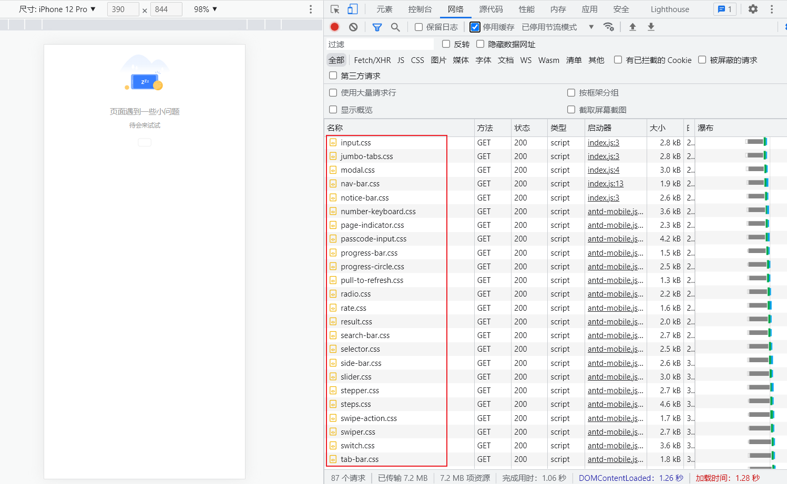
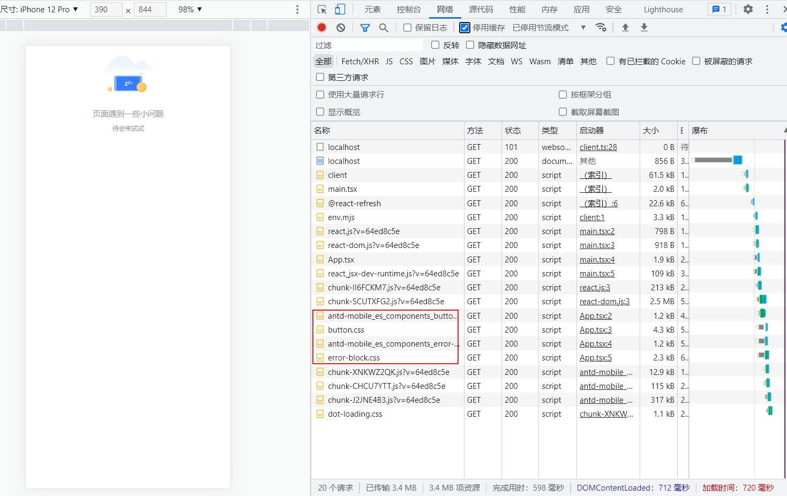

[](https://github.com/liuweiGL/vite-plugin-demand-import/actions/workflows/release.yml)
[](https://badge.fury.io/js/vite-plugin-demand-import)
## Vite Plugin Demand Import

为 **带有副作用** 的库提供 “按需加载” 功能。

**[English Document](./README_EN.md)** 

## 快速开始

```shell
pnpm add vite-plugin-demand-import -D
```

```ts
import { defineConfig } from 'vite'
import demandImport from 'vite-plugin-demand-import'

export default defineConfig({
  plugins: [
    demandImport({
      lib: 'antd-mobile',
      resolver: {
        js({ name }) {
          return `antd-mobile/es/components/${name}`
        }
      }
    })
  ]
})

/////////// 编译结果 ////////////
import { Button } from 'antd-mobile'

↓ ↓ ↓ ↓ ↓ ↓

import Button from 'antd-mobile/es/components/button'
```

## 优化效果

<details>
<summary>对比</summary>   



---



</details>

## 接口

```ts
export type ResolverOptions = {
  /**
   * 被导入的模块标识，import { Button } from 'antd-mobile' 中 name 等于 'Button'
   */
  name: string

  /**
   * 当前被解析文件的 id，一般是文件的绝对路径
   */
  file: string
}

/**
 * 返回 import xxx from 'yyy' 语句中的 yyy
 */
export type Resolver = (options: ResolverOptions) => string

export type DemandImportOptions = {
  /**
   * 类库的名称，用来判断当前 import 语句是否需要处理
   */
  lib: string

  /**
   * 库的命名风格
   *
   * @default  "kebab-case"
   * @description "default" 将不做处理
   */
  namingStyle?: 'kebab-case' | 'camelCase' | 'PascalCase' | 'default'

  /**
   * 路径解析器
   */
  resolver: {
    js?: Resolver // 返回 js 文件的导入路径
    style?: Resolver // 返回样式文件的导入路径
  }
}
```

## Why

在使用各种 “xxx-import” 插件之前我们需要先区分几个概念：

1. tree shaking：中文 “摇树”，指对没有使用到的代码在 `编译阶段` 进行删减。
2. 自动导入：根据配置的策略在 `编译阶段` 自动插入导入语句。
3. 按需加载：指在 `运行时` 动态返回用户当前访问的资源。

简单的代码说明：

1. tree shaking:

```ts
// a.js
export const a1 = 1
export const a2 = 2

//b.js
export const b1 = 1
export const b2 = 2

// index.js
import { a1 } from './a'
import { b1 } from './b'

console.log(a1)

////////// 使用 rollup 打包 ////////////

// dist/index.js
const a1 = 1
console.log(a1)
```

`a.js` & `b.js` 中没有用到的代码都被删减掉了。

2. 自动导入：

```ts
import { Button } from 'antd'

///////// 使用 xxx-import 插件 /////////
import { Button } from 'antd'
// 自动插入了样式的导入语句
import 'antd/lib/style/button/index.less'
```

3. 按需加载：

```ts
if (location.pathname.include('/login')) {
  import('./login.js').then((res) => {
    // do something
  })
}
```

目前主要是路由中用的多，比如 `vue-router`、`react-router` 中我们经常会配置：

```ts
export const routes = [
  {
    name: 'login',
    path: '/login',
    component: () => import('./Login/index')
  }
]
```

需要注意的是 **日常表述中** “按需加载” 在不同的场景下跟 “tree shaking” 或者 “自动导入” 是等价的。比如：

1. 我们使用 lodash 库时期望的是 “tree shaking” 行为，但是我们也可以说成 “按需加载” lodash。
2. 我们在使用 UI 库时期望的是 “自动导入” 行为，但是我们也可以说成 “按需加载” 样式。

## tree shaking

网上关于这个特性的文章很多了，这里只大概说一下我知道的几种方式：

1. esm 规范的 export & import 是静态绑定的，rollup 编译时可以分析出哪个模块是用到的哪个模块是没用到的，只要类库的 package.json 申明了 `sideEffects: false` 便可以自动 tree shaking。
2. commonjs 规范的 require 是动态的，所以 tree shaking 是非常困难的。rollup 处理 commonjs 模块时依赖 `@rollup/plugin-commonjs` 插件进行 commonjs 到 esm 的转换。这个插件默认的行为是：如果模块使用 `exports.xxx` 导出会 tree shaking，而 `modules.exports` 导出则不会。
3. 手动指定包下面的具体模块，比如使用 `import round from 'lodash/round'` 代替 `import { round } from 'lodash'`。

关于这块可以使用 `lodash` 跟 `lodash-es` 进行测试，前者不会 tree shaking 而后者会。

### 静态&动态导入的简单解释

一句话概括就是可以在运行时按需导入的就是“动态导入”，在编码时写死的就是“静态导入”：

```ts
import a from 'a' // 静态导入

if (flag) {
  import 'a' // 动态导入，esm 不支持该行为
}
```

```ts
const a = require('a') // 静态导入

if (flag) {
  require('a') // 动态导入，commonjs 支持该行为
}
```

## 目前已有的 `xxx-import` 插件

### [babel-plugin-import](https://github.com/umijs/babel-plugin-import)

antd 官方出品，感觉可以算这个领域最知名的类库吧，功能非常齐全。比如：

1. tree shaking: 因为当时还是 webpack 的天下，大多数的包也都是 commonjs 规范的，所以当时一般都是使用第三种方式来实现该特性。对应的配置为：

```ts
// .babelrc
{
  "plugins": [["import", {
      "libraryName": "antd"
  }]]
}

// 效果
import { Button } from 'antd';

      ↓ ↓ ↓ ↓ ↓ ↓

var _button = require('antd/lib/button');

```

2. 自动导入：使用 UI 库的时候一般可以选择 “全局导入” 和 “按需导入” 引入样式文件，当选择后者的时候就可以让插件帮我们自动插入导入语句：

```ts
// .babelrc
{
  "plugins": [["import", {
      "libraryName": "antd",
      style: true
  }]]
}

// 效果
import { Button } from 'antd';


      ↓ ↓ ↓ ↓ ↓ ↓

var _button = require('antd/lib/button');
require('antd/lib/button/style'); // 自动插入了导入语句
```

这里只展示最简单的用法，更多复杂的配置可以查看官方文档，感觉基本没有解决不了的场景。

不过随着 esm 的普及以及在常规项目中 “全局导入” 比 “按需加载” 并不会大多少体积，所以作者推荐<sup>?</sup> 用 “全局导入” 代替 “按需加载”，这个插件也就不再需要了。

> 相关结论是 babel-plugin-import 某个 issue 中作者说的，一时找不到链接了 ~~~

### [vite-plugin-style-import](https://github.com/vbenjs/vite-plugin-style-import)

库如其名，这个是 vite 框架的插件。

因为 vite 是基于 rollup 构建的，js 代码一般都可以自动 tree shaking，所以只需要处理样式文件的 “自动导入” 就好了：

```ts
import { ElButton } from 'element-plus';

        ↓ ↓ ↓ ↓ ↓ ↓

// dev
import { Button } from 'element-plus';
import 'element-plus/lib/theme-chalk/el-button.css`;

// prod
import Button from 'element-plus/lib/el-button';
import 'element-plus/lib/theme-chalk/el-button.css';
```

值得一提的是作者非常细心的区分了开发跟正式环境:

1. 开发环境中 vite 的 optimize 不会因为新的组件导入而刷新。
2. 可能是怕有些类库没有配置 `sideEffects` 导致 tree shaking 不生效？

## 我遇到的问题

上面扯了那么多终于到重点了，哈哈。

其实问题还是出在 UI 库构建时对样式的处理差异上，比如 antd 的组件代码跟样式是分离的：

```
button
    |—— style/index.js
    └—— index.js
```

这时候使用 vite-plugin-style-import 自动导入样式就好了。

但是 [antd-mobile](https://github.com/ant-design/ant-design-mobile) 构建出来的是：

```
button
    |—— button.css
    |—— button.js
    └—— index.js
```

```ts
// index.js
import './button.css'
import { Button } from './button'
export default Button
```

官方为了“方便”用户使用而自动在组件入口引入了样式文件，对应的 `sideEffects` 配置：

```ts
  "sideEffects": [
    "**/*.css",
    "**/*.less",
    "./es/index.js",
    "./src/index.ts",
    "./es/global/index.js",
    "./src/global/index.ts"
  ],
```

当我们在 vite 中使用时：

```ts
import { Button } from 'antd-mobile'
```

第一步，rollup 会去 _node_module/antd-mobile/package.json_ 中查看 `module` 或者 `main` 字段定义的入口文件。

第二步，找到 _node_module/antd-mobile/es/index.js_ 文件：

<details>
 <summary>index.js</summary>
 <pre>
import './global';
export { setDefaultConfig } from './components/config-provider';
export { default as ActionSheet } from './components/action-sheet';
export { default as AutoCenter } from './components/auto-center';
export { default as Avatar } from './components/avatar';
export { default as Badge } from './components/badge';
export { default as Button } from './components/button';
export { default as Calendar } from './components/calendar';
export { default as CapsuleTabs } from './components/capsule-tabs';
export { default as Card } from './components/card';
export { default as CascadePicker } from './components/cascade-picker';
export { default as CascadePickerView } from './components/cascade-picker-view';
export { default as Cascader } from './components/cascader';
export { default as CascaderView } from './components/cascader-view';
export { default as CheckList } from './components/check-list';
export { default as Checkbox } from './components/checkbox';
export { default as Collapse } from './components/collapse';
export { default as ConfigProvider } from './components/config-provider';
export { default as DatePicker } from './components/date-picker';
export { default as DatePickerView } from './components/date-picker-view';
export { default as Dialog } from './components/dialog';
export { default as Divider } from './components/divider';
export { default as DotLoading } from './components/dot-loading';
export { default as Dropdown } from './components/dropdown';
export { default as Ellipsis } from './components/ellipsis';
export { default as Empty } from './components/empty';
export { default as ErrorBlock } from './components/error-block';
export { default as FloatingBubble } from './components/floating-bubble';
export { default as FloatingPanel } from './components/floating-panel';
export { default as Form } from './components/form';
export { default as Grid } from './components/grid';
export { default as Image } from './components/image';
export { default as ImageUploader } from './components/image-uploader';
export { default as ImageViewer } from './components/image-viewer';
export { default as IndexBar } from './components/index-bar';
export { default as InfiniteScroll } from './components/infinite-scroll';
export { default as Input } from './components/input';
export { default as JumboTabs } from './components/jumbo-tabs';
export { default as List } from './components/list';
export { default as Loading } from './components/loading';
export { default as Mask } from './components/mask';
export { default as Modal } from './components/modal';
export { default as NavBar } from './components/nav-bar';
export { default as NoticeBar } from './components/notice-bar';
export { default as NumberKeyboard } from './components/number-keyboard';
export { default as PageIndicator } from './components/page-indicator';
export { default as PasscodeInput } from './components/passcode-input';
export { default as Picker } from './components/picker';
export { default as PickerView } from './components/picker-view';
export { default as Popover } from './components/popover';
export { default as Popup } from './components/popup';
export { default as ProgressBar } from './components/progress-bar';
export { default as ProgressCircle } from './components/progress-circle';
export { default as PullToRefresh } from './components/pull-to-refresh';
export { default as Radio } from './components/radio';
export { default as Rate } from './components/rate';
export { default as Result } from './components/result';
export { default as SafeArea } from './components/safe-area';
export { default as ScrollMask } from './components/scroll-mask';
export { default as SearchBar } from './components/search-bar';
export { default as Selector } from './components/selector';
export { default as SideBar } from './components/side-bar';
export { default as Skeleton } from './components/skeleton';
export { default as Slider } from './components/slider';
export { default as Space } from './components/space';
export { default as SpinLoading } from './components/spin-loading';
export { default as Stepper } from './components//stepper';
export { default as Steps } from './components/steps';
export { default as SwipeAction } from './components/swipe-action';
export { default as Swiper } from './components/swiper';
export { default as Switch } from './components/switch';
export { default as TabBar } from './components/tab-bar';
export { default as Tabs } from './components/tabs';
export { default as Tag } from './components/tag';
export { default as TextArea } from './components/text-area';
export { default as Toast } from './components/toast';
export { default as TreeSelect } from './components/tree-select';
export { default as VirtualInput } from './components/virtual-input';
export { default as WaterMark } from './components/water-mark';
</pre>
</details>

第三步，处理 _index.js_ 文件中的导入。因为 `button` 被用到了肯定会加载，而其他组件因为没有用到会被 tree shaking 掉。但是这里存在一个问题：每个组件都引入了样式文件，而 css 类型是被定义成 “有副作用” 的（这个没错）。这就导致组件的 js 文件虽然不会导入，但这个组件所引用的样式会被导入，最后就是整个库的 css 全部被导入了。

总所皆知，vite 的性能由传统的 bundle 处理能力转向了浏览器处理请求的效率：

1. 提高浏览器的并发量：开启 vite 的 https 服务。
2. 浏览器缓存：因为 vite 内置的 https 是自签名证书通不过浏览器检测，本地缓存是不会生效的。这个时候可以使用我的 [vite-plugin-mkcert](https://github.com/liuweiGL/vite-plugin-mkcert) 插件为 https 提供本地证书支持。
3. 减少请求量。

回到这个问题，解决方式有两个：

1. 向官方反馈把组件中的样式引入去掉，这不现实（我个人感觉这是个“反优化”）。
2. 不要从包的入口去引用组件，改成指定模块的导入：

```ts
import { Button } from 'antd-mobile'

↓ ↓ ↓ ↓ ↓ ↓

import Button from 'antd-mobile/es/components/button'
```

emm，兜兜转转终于还是回到了原点，就问苍天饶过谁 😘

---

所以这个问题是可以用 `babel-plugin-import` 来解决的，而 vite 中也有 [vite-plugin-importer](https://github.com/ajuner/vite-plugin-importer) 对应封装的插件。

但是我觉得在 rollup 中使用 babel 很不 “vite”，哈哈哈 ~~~
