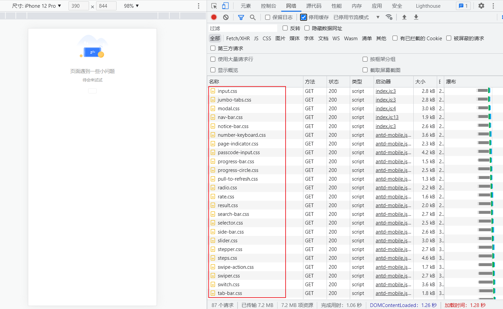

## [📙 中文文档](./README.md)
## Vite Plugin Demand Import

Provides "import-on-demand" functionality for the library with side effects.

## Quick Start

```shell
pnpm add vite-plugin-demand-import -D
```

```ts
import { defineConfig } from 'vite'
import demandImport from 'vite-plugin-demand-import'

export default defineConfig({
  plugins: [
    demandImport({
      lib: 'antd-mobile',
      resolver: {
        js({ name }) {
          return `antd-mobile/es/components/${name}`
        }
      }
    })
  ]
})

/////////// Compilation result ////////////
import { Button } from 'antd-mobile'

↓ ↓ ↓ ↓ ↓ ↓

import Button from 'antd-mobile/es/components/button'
```

##Optimize the effect

<details>
<summary>Comparison</summary>



---


</details>

## Interface

```ts
export type ResolverOptions = {
  /**
   * The imported module identifier, the name in import { Button } from 'antd-mobile' is equal to 'Button'
   */
  name: string

  /**
   * The id of the currently parsed file, usually the absolute path of the file
   */
  file: string
}

/**
 * return yyy in import xxx from 'yyy' statement
 */
export type Resolver = (options: ResolverOptions) => string

export type DemandImportOptions = {
  /**
   * The name of the class library, used to determine whether the current import statement needs to be processed
   */
  lib: string

  /**
   * Library naming style
   *
   * @default "kebab-case"
   * @description "default" will not be processed
   */
  namingStyle?: 'kebab-case' | 'camelCase' | 'PascalCase' | 'default'

  /**
   * path resolver
   */
  resolver: {
    js?: Resolver // Returns the import path of the js file
    style?: Resolver // Returns the import path of the style file
  }
}
```
